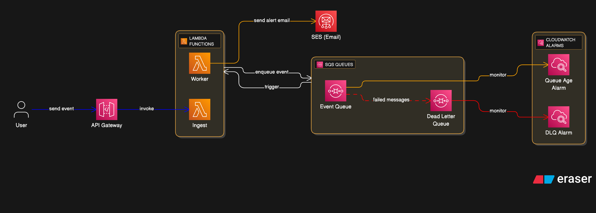

# Documentación Técnica - Fleet Early Warning System (FEWS)

## 1. Decisiones de Arquitectura

La solución implementa una arquitectura **Serverless Asíncrona** basada en el patrón **Storage First** (Ingesta -> Cola -> Proceso).

### 1.1 Amazon API Gateway (Ingesta y Protección)

- **Decisión:** Utilizar API Gateway con configuración de Throttling y autenticación vía API Keys.
- **Justificación:**
  - **Control de Tráfico:** Se configuró un **Rate Limit de 15 req/s** y un **Burst de 2000**. El valor de _Burst_ es crítico: permite absorber el pico de 1000 peticiones en segundos (cumpliendo el requerimiento de carga) sin rechazar tráfico, mientras que el _Rate_ protege a las Lambdas de saturación sostenida.
  - **Seguridad:** Uso de API Keys para asegurar que solo dispositivos autorizados de la flota envíen telemetría.

### 1.2 AWS Lambda (Cómputo Efímero)

- **Decisión:** Separación de responsabilidades en dos funciones: `ingest` (síncrona) y `worker` (asíncrona).
- **Justificación:**
  - **Función `ingest`:** Diseñada para ser extremadamente ligera (<200ms). Su única tarea es validar y enviar a SQS. Esto libera rápidamente las conexiones del API Gateway, evitando cuellos de botella.
  - **Función `worker`:** Procesa la lógica de negocio pesada (detección de emergencias y envío de emails) sin bloquear al cliente.
  - **Cumplimiento de Restricciones:** Al procesar de forma asíncrona, controlamos la concurrencia para no exceder las **10 instancias simultáneas** permitidas.

### 1.3 Amazon SQS (Buffer y Desacoplamiento)

- **Decisión:** Introducción de una cola SQS estándar entre la ingesta y el procesamiento.
- **Justificación:**
  - **Amortiguación de Picos (Buffering):** Permite recibir 1000 peticiones en 30 segundos, almacenarlas de inmediato y procesarlas al ritmo que la función `worker` permita.
  - **Resiliencia:** Si el servicio de correo (SES) falla o es lento, los mensajes no se pierden; quedan en cola esperando reintento.

### 1.4 Amazon SES (Notificaciones)

- **Decisión:** Integración nativa para envío de correos transaccionales.
- **Justificación:** Baja latencia de envío y alta integración con IAM para seguridad, eliminando la necesidad de gestionar credenciales SMTP en código.

---

## 2. Atributo de Calidad más Importante

### 🎯 Confiabilidad (Reliability)

Se priorizó la **Confiabilidad** sobre la latencia absoluta. En un sistema de emergencias, el fallo crítico no es "tardar un segundo más", sino "perder una alerta".

**Justificación de la prioridad:**
Dado el escenario de 1000 peticiones concurrentes, una arquitectura puramente síncrona correría el riesgo de perder eventos por _timeouts_ o _throttling_ agresivo. La arquitectura elegida garantiza que, una vez el evento entra al API Gateway y llega a SQS (Persistencia), **el evento se procesará eventualmente**, asegurando que la alerta de emergencia llegue incluso si hay congestión momentánea.

---

## 3. Diagrama de la Arquitectura

El flujo de datos es:

1.  **Vehículo** -> HTTPS POST -> **API Gateway** (Protección)
2.  **API Gateway** -> **Lambda Ingest** -> **SQS** (Persistencia)
3.  **SQS** -> Trigger (Batch de 10) -> **Lambda Worker**
4.  **Lambda Worker** -> **SES** (Alerta)

---

## 4. Tácticas de Arquitectura

### 4.1 Tácticas de Disponibilidad y Resiliencia

- **Desacoplamiento Asíncrono (Asynchronous Decoupling):** El cliente recibe un `200 OK` apenas el mensaje entra a la cola. El procesamiento ocurre en segundo plano. Esto aísla la recepción de datos de posibles fallos en el envío de correos.
- **Dead Letter Queue (DLQ):** Se configuró una cola de mensajes muertos. Si un mensaje falla tras 5 intentos (por ejemplo, error en SES), se mueve a la DLQ para no bloquear la cola principal y permitir análisis forense posterior.
- **Reintentos (Retries):** Configuración automática de reintentos en SQS para manejar fallos transitorios de red o límites de API de terceros.

### 4.2 Tácticas de Desempeño (Performance)

- **Procesamiento por Lotes (Batching):** La función `worker` procesa mensajes en grupos de 10. Esto reduce drásticamente las invocaciones de Lambda (de 1000 a 100), optimizando tiempos de arranque (Cold Starts) y costos.
- **Throttling & Bursting:** Configuración explícita en API Gateway (`Rate: 15`, `Burst: 2000`) para cumplir con la restricción del reto sin degradar el servicio durante la ráfaga inicial de datos.

### 4.3 Tácticas de Observabilidad

- **Monitoreo de Profundidad de Cola (Queue Depth Monitoring):** Alarma `QueueAgeAlarm` configurada en CloudWatch para detectar si los mensajes se acumulan demasiado tiempo, indicando que los consumidores (workers) son insuficientes.
- **Trazabilidad Distribuida:** Uso de Logs estructurados en CloudWatch para correlacionar la recepción del evento (Ingest) con su procesamiento final (Worker).

